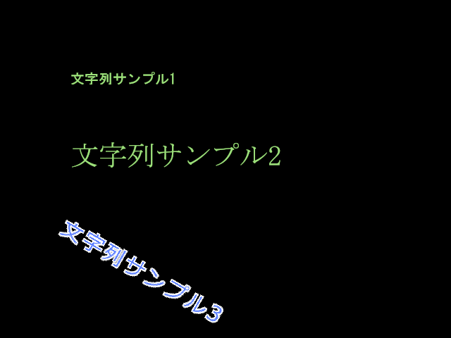

## フォント (Font)

### 概要

描画する文字の書体、サイズ、枠線等の情報を定義します。実際に文字列を描画する際には[テキストオブジェクト2D](../2D/TextObject.md)にフォントを渡します。

### フォントの生成方法

#### .affファイルを生成して読み込む
[フォントジェネレータ](../Tool/FontGenerator.md)を用いて、フォントのファイル(.affファイル)を生成します。生成した.affファイルを[グラフィックスクラス(Graphics)](./Graphics.md)のCreateFont関数に使用したいフォントのファイル(.affファイル)を指定することでフォントを作成することが出来ます。詳しくは、[フォントジェネレータ](../Tool/FontGenerator.md)の項目をご覧ください。

#### フォントファイルを読み込んで動的に生成する
[グラフィックスクラス(Graphics)](./Graphics.md)のCreateDynamicFont関数に、OSにインストールされたフォント名やファイルへのパスを渡すことで、フォントを作成することができます。

OSにインストールされたフォント名を指定する場合、英語名で指定する必要があります。(例：メイリオ→Meiryo)

ファイルを指定する場合、ttc、ttf、otfといった様々なフォントのファイルを指定できます。

引数にnullか""を指定するとOS標準のフォントが使用されます。

### .affとフォントファイルのメリット・デメリット
.affを使用する場合、作成する手間がある分、実行する環境にフォントが存在しなくても文字を描画することができます。
一方、フォント名を指定すると手軽に文字を表示できますが、実行する環境にフォントが存在しない場合、文字を描画できません。

フォントファイルを同梱すると両方の問題を解決できますが、フォントファイルのライセンスに注意する必要があります。

### 主なメソッド

なし

### 主なプロパティ

なし

### 主なイベント

なし

### 使用方法

テキストオブジェクト2Dのサンプルを参照してください。
