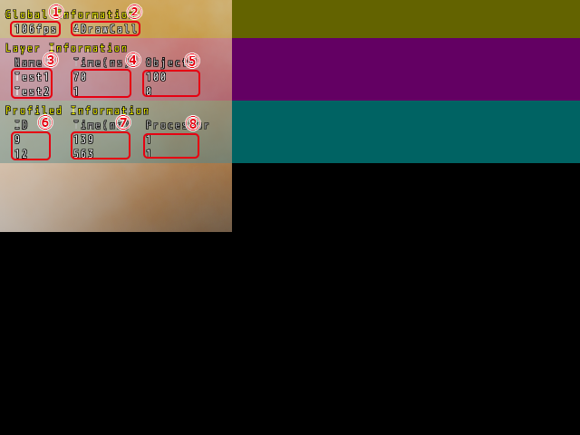

#プロファイラ
ACEの機能であるプロファイラを使用して、コードの特定範囲の実行時間や、レイヤーの各情報などを調べることができます。

##コードのプロファイリング
ACEのプロファイラ機能は、コードの特定範囲の処理の実行時間を調べ、ゲームの処理を軽量化するための参考にする目的に使用します。

プロファイラ機能を使うには、次のように実行時間が知りたい処理の範囲を`Start`,`End`メソッドで囲んでください。この２つのメソッドに指定するIDは、`Start`,`End`で対応し、コード全体で一意になるように注意してください。

```C#
// 計測開始(ID=9)
Engine.Profiler.Start(9);

// 実行時間を知りたい処理
Something1();
Something2();

// 計測終了
Engine.Profiler.End(9);
```

そして、ゲームコードのどこかで`Engine.ProfilerIsVisible`を`true`に設定すると、次のように計測結果が画面に表示されます。`false`に設定すると、非表示になります。上記のコードでの計測結果は"Profiled Information"の節に表示されます。


##プロファイリング結果の見方



###Global Information
①：ゲームのfps。

②：ドローコール数。これが小さいほど描画が軽くなります。

###Layer Information
③：レイヤー名。

④：各レイヤーの更新時間（Updateにかかった時間）。

⑤：各レイヤーに登録されているオブジェクトの数。

###Profiled Information
⑥：プロファイリングの際に指定したID。

⑦：各部分の実行時間。

⑧：各部分を実行したCPU番号。
